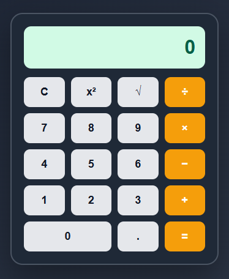

# 🧮 Calculadora

Una calculadora sencilla e interactiva desarrollada con **HTML5** y **CSS3**, pensada para realizar operaciones matemáticas básicas y algunas operaciones especiales de forma rápida y con una interfaz limpia y responsiva.

## 📋 Descripción

Este proyecto es una calculadora funcional construida completamente con tecnologías web front-end. El objetivo principal fue practicar y aplicar buenas prácticas de estructuración semántica en HTML5 y estilizado moderno con CSS3, logrando un diseño atractivo y fácil de usar.

## ✨ Características

- Interfaz simple e intuitiva
- Operaciones matemáticas básicas (suma, resta, multiplicación, división)
- Operación de potencia al cuadrado (x²)
- Operación de raíz cuadrada (√x)
- Diseño responsivo, adaptable a distintos tamaños de pantalla
- Estilos personalizados con CSS3 (colores, sombras, animaciones y transiciones)
- Código limpio y organizado

## 🛠️ Tecnologías utilizadas

- **HTML5** – Estructura y semántica de la aplicación
- **CSS3** – Estilos, diseño responsivo y efectos visuales

## 📂 Estructura del proyecto

```
Calculadora/
│
├── index.html      # Estructura principal de la calculadora
├── style.css       # Estilos y diseño visual
└── README.md        # Documentación del proyecto
```

## 🚀 Cómo usarlo

1. Clona este repositorio:
   ```bash
   git clone https://github.com/Edupe2603/CalculadoraES
   ```
2. Ingresa a la carpeta del proyecto:
   ```bash
   cd CalculadoraES
   ```
3. Abre el archivo `index.html` en tu navegador favorito.

¡Y listo! Ya puedes empezar a realizar tus cálculos. 🎉

## 📸 Vista previa



## 🔮 Posibles mejoras futuras

- Agregar funcionalidad con JavaScript (operaciones dinámicas)
- Incluir soporte para teclado
- Añadir historial de operaciones
- Modo oscuro / claro
- Incorporar más operaciones (porcentaje, factorial, potencias personalizadas)

## 🤝 Contribuciones

Las contribuciones son bienvenidas. Si deseas mejorar este proyecto, no dudes en abrir un *issue* o enviar un *pull request*.

## 📄 Licencia

Este proyecto está bajo la licencia MIT. Puedes usarlo y modificarlo libremente citando la fuente original.

---

Desarrollado con 💻 y ☕ como parte de mi aprendizaje en desarrollo web full-stack.